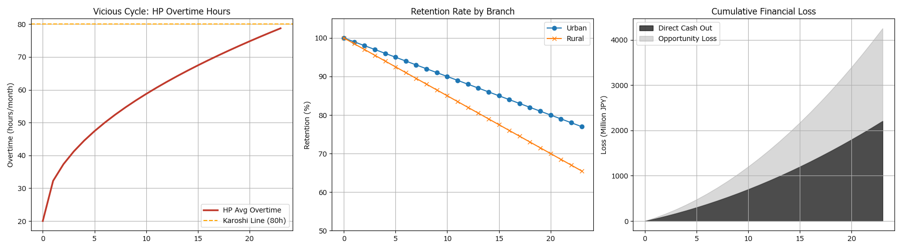
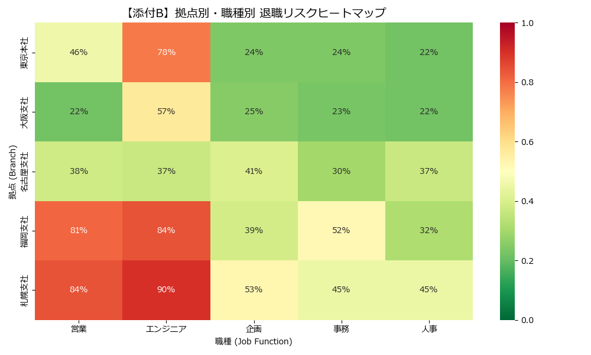
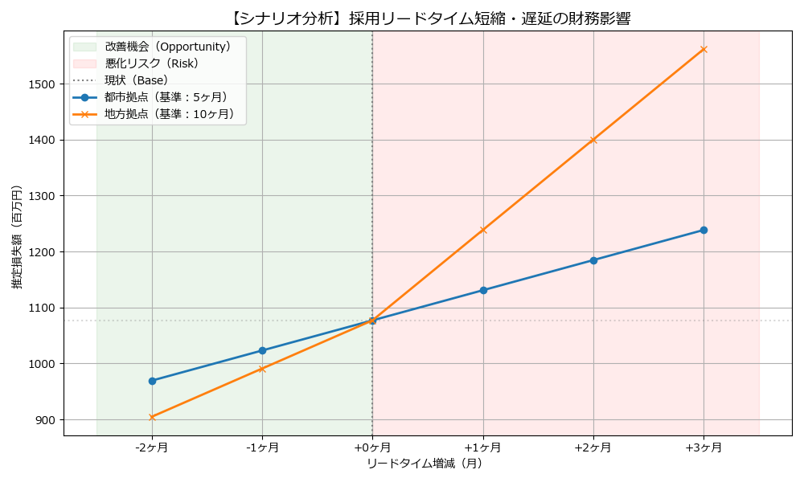

# Strategic Organizational Resilience Simulation
**戦略的組織レジリエンス構築：人材トリアージとROI分析**

## 📌 Project Overview
2030年の労働供給不足を見据え、既存人材の離職が引き起こす「組織の機能不全（負の連鎖）」をPythonでシミュレーション。
「直接的な現金流出」だけでなく「機会損失」を含めたリスクを定量化し、ROI 217% の投資対効果を持つ「人材トリアージ戦略」を立案しました。

## 📊 Key Visuals

### 1. 組織崩壊シミュレーション (Simulation Result)
離職の連鎖により、24ヶ月で約11億円の直接損失が発生するシナリオ。

### 2. リスクヒートマップ (Risk Heatmap)
部署・職種ごとの離職リスクを可視化し、優先対策エリアを特定。

### 3. 感度分析 (Sensitivity Analysis)
採用リードタイム短縮による財務インパクトの改善効果を試算。

## 📄 Strategy Report
より詳細な分析ロジックと戦略提言は以下のPDFレポートをご覧ください。
- [👉 **Strategic_Org_Resilience_Report.pdf**](report/Strategic_Org_Resilience_Report.pdf)

## 🛠 Tech Stack
- **Simulation**: Monte Carlo Method (Python)
- **Visualization**: Matplotlib, Seaborn
- **Language**: Python 3.12
