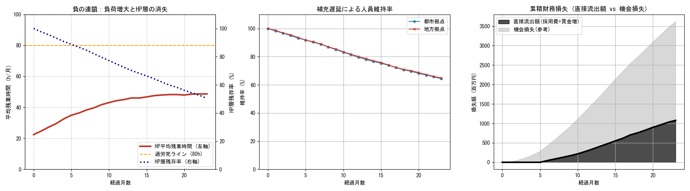
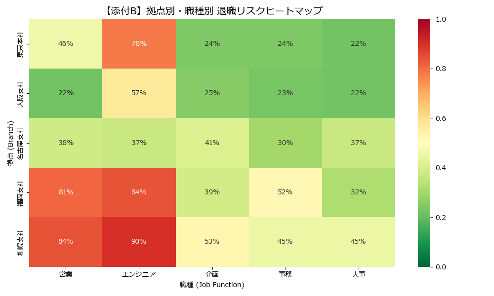
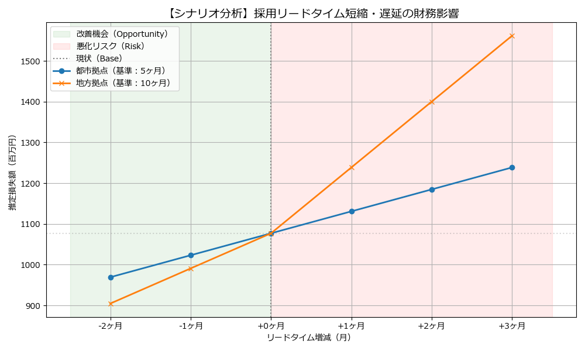

# Strategic Organizational Resilience Simulation
**戦略的組織レジリエンス構築：人材トリアージとROI分析**

## 📌 Project Overview
2030年の労働供給不足を見据え、既存人材の離職が引き起こす「組織の機能不全（負の連鎖）」をPythonによるモンテカルロ・シミュレーションで定量化。
単純な「採用難」のリスクだけでなく、既存社員（特にハイパフォーマー）への負荷集中による連鎖的な離職リスクをモデル化しました。

「直接的な現金流出」だけでなく「機会損失」を含めたリスク総額を算出し、ROI 217% の投資対効果を持つ「人材トリアージ戦略」を立案しています。

---

## 📄 Full Report (Detailed Analysis)
**詳細な分析ロジック、数理モデルの解説、およびトリアージ戦略の提言書**
> **[👉 Download PDF: 戦略的組織レジリエンス構築レポート (Ver.4)](report/Strategic_Org_Resilience_Report.pdf)**

> **👆 Click to Run App**: ブラウザ上で「組織崩壊シミュレーション」を体験できます。
---

## 📊 Key Simulation Results

### 1. 負の連鎖シミュレーション (Negative Chain "Death Spiral")
**【New Analysis】**
離職の連鎖が「ハイパフォーマーへの負荷集中（残業増）」を引き起こし、組織が機能不全に陥るプロセスを可視化。
24ヶ月で約11億円の直接財務損失（採用費＋人件費増）が発生するリスクを算出しました。

### 2. リスクヒートマップ (Risk Heatmap)
部署・職種ごとの離職リスクを可視化し、優先対策エリアを特定。

### 3. 感度分析 (Sensitivity Analysis)
採用リードタイム短縮による財務インパクトの改善効果を試算。

---

## 🛠 Tech Stack & Source Code

- **Language**: Python 3.12
- **Libraries**: Pandas, NumPy, Matplotlib, Seaborn
- **Methodology**: Agent-Based Monte Carlo Simulation

### 📂 Source Code
- **[simulation_negative_chain.py](python/simulation_negative_chain.py)**
  負の連鎖（デススパイラル）と財務損失を計算するシミュレーションのソースコード。
<<<<<<< HEAD

  ---

# Strategic Organizational Resilience Simulator
**戦略的組織レジリエンス構築：組織崩壊シミュレーター Ver.3.2**

> **👆 Click to Run App**: ブラウザ上で「組織崩壊の負の連鎖」と「財務超過損失」をシミュレーションできます。

---

## 📌 Project Overview
**「採用の遅れ」や「離職の連鎖」が、経営にどれだけの財務インパクトを与えるか？**

本プロジェクトは、レポート『戦略的組織レジリエンスの構築』に基づき、組織の機能不全リスクを定量化するシミュレーターです。
単純な離職コストの計算にとどまらず、**「本来かかるはずのなかった超過コスト（Excess Cost）」**と**「機会損失（Opportunity Loss）」**を可視化し、経営判断に必要なROI根拠を提供します。

### 🚀 What's New in Ver.3.2
- **💰 Budget vs Actual Analysis (予実差異分析)**:
  「通常の代謝に伴う採用予算」と「負の連鎖による超過コスト」を分離。**"真の損失額"** を特定するアルゴリズムを実装しました。
- **🏢 SME Support (小規模組織対応)**:
  従業員数10名〜のシミュレーションに対応。スタートアップや中小企業の組織リスク分析も可能になりました。
- **📊 Interactive Loss Visualization**:
  損失構造（予算内コスト / 超過コスト / 機会損失）を積み上げグラフで可視化。

---

## 🎥 Demo
**組織規模や年収条件を変更し、リアルタイムに「崩壊リスク」を診断**

*(※画面は開発中のものです)*

---

## 💎 Business Value
本ツールは、人事・経営企画・マネジメント層に対し、以下の価値を提供します。

1.  **「見えない損失」の可視化**: 
    PL（損益計算書）には表れない「機会損失」や、採用費の中に埋没している「超過コスト」を明確にします。
2.  **予兆管理 (Risk Anticipation)**: 
    「有効組織能力」という指標を用い、売上が落ちる前に組織が内部崩壊する兆候（ティッピング・ポイント）を検知します。
3.  **投資対効果 (ROI) の算出**: 
    「リテンション施策」や「採用プロセスの改善」が、どれだけのキャッシュアウトを防ぐかを金額換算します。

---

## 🧮 Logic Overview (Ver.3.2)

本モデルは、**「有効組織能力 (Effective Capacity)」** と **「財務超過損失 (Excess Financial Loss)」** を核とした独自アルゴリズムを採用しています。

### 1. 財務超過損失 (Excess Financial Loss)
「人が辞めたから採用するコスト」すべてを損失とはみなしません。通常の離職率に基づく「予算内コスト」を差し引いた分こそが、負の連鎖による経営打撃であると定義しています。

$$Loss_{excess} = Cost_{actual} - Cost_{budget}$$
- **$Cost_{budget}$**: 基準離職率に基づく想定採用コスト
- **$Cost_{actual}$**: 負の連鎖（負荷増→離職増）により実際に発生したコスト

### 2. 有効組織能力 (Effective Capacity)
人数 ($Headcount$) ではなく、習熟度を考慮した能力総量で組織状態を評価します。
$$Capacity = \sum (N_{tenured} \times 1.0) + \sum (N_{new} \times f(t))$$
- 新規採用者は即戦力ではなく、立ち上がり期間 ($RampUp$) を経て貢献度が上昇します。

### 3. 非線形な燃え尽き (Non-linear Burnout)
能力不足は残業（負荷）に直結し、負荷が閾値を超えると離職率 ($P$) が指数関数的に悪化します。
$$P_{leave} \propto (\text{Workload Index} - 1.0)^{1.5}$$

---

## 🛠 Tech Stack
- **Language**: Python 3.12
- **Frontend**: Streamlit
- **Visualization**: Plotly (Interactive Charts)
- **Deployment**: Streamlit Community Cloud

### 📂 Source Code
- **[app.py](app.py)**: シミュレーションロジックおよびUIの実装コード。
- **[strategic-org-resilience/](strategic-org-resilience/)**: 初期の分析スクリプトおよび検証用ノートブック。

---

## 📄 Related Reports
- **[👉 戦略的組織レジリエンス構築レポート (PDF)](report/Strategic_Org_Resilience_Report.pdf)**
  本シミュレーターの基礎となった理論、数理モデルの詳細解説、および提言書。

---
pip install -r requirements.txt
streamlit run app.py
