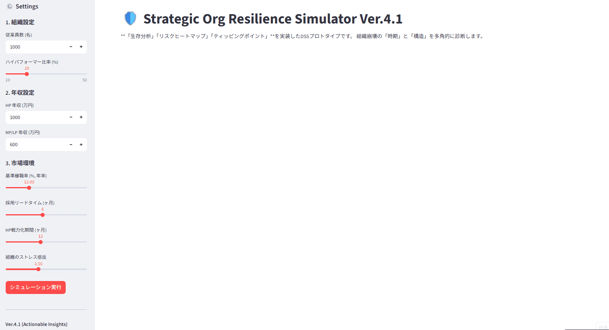
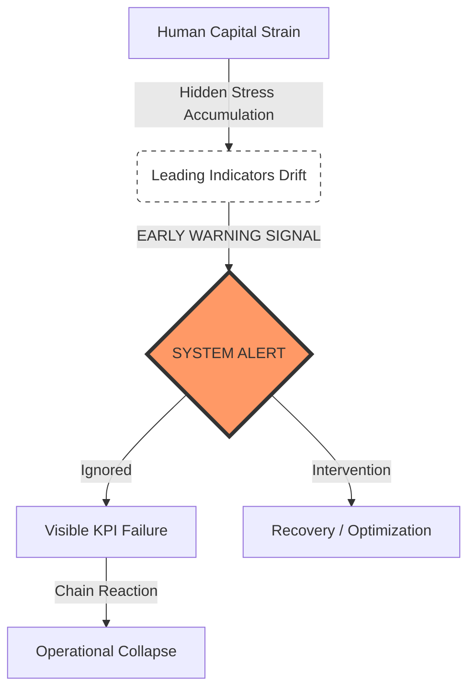

# 🛡️ Operational Early-Warning System for Organizational Failure
**(Formerly: Strategic Org Resilience Simulator)**
**組織の「隠れた負荷連鎖」を解析し、業務機能停止（System Down）を未然に防ぐ早期警戒システム**

[](https://strategic-org-resilience-9ejs4h2kqqpx5zdwuygri9.streamlit.app/)


<br>



---

## 📌 Executive Summary

**This project implements an early-warning system that detects structural failure signals in business operations before KPIs, costs, or project schedules visibly collapse.**

多くの組織崩壊は、売上や納期（KPI）が悪化する数ヶ月前に、現場の**「負荷の偏在」**と**「隠れたストレス連鎖」**から始まります。
本プロジェクトは、人的資本データと業務ログを構造化し、**組織が機能不全に陥る「臨界点（Tipping Point）」を事前に特定する**ための**意思決定支援システム（DSS）プロトタイプ**です。

事後的な「離職分析」ではなく、未来の「業務停止リスク」を回避するための **Early-Warning System** として設計されています。

---

## 🔍 Logic: How it detects the invisible


```mermaid
graph TD
    A[Human Capital Strain] -->|Hidden Stress Accumulation| B(Leading Indicators Drift)
    B -->|EARLY WARNING SIGNAL| C{SYSTEM ALERT}
    C -->|Ignored| D[Visible KPI Failure]
    C -->|Intervention| E[Recovery / Optimization]
    D -->|Chain Reaction| F[Operational Collapse]

    style C fill:#f96,stroke:#333,stroke-width:4px
    style B fill:#fff,stroke:#333,stroke-dasharray: 5 5
```

---

## 🎯 Business Use Cases (Risk Consulting)
本モデルは、人事課題ではなく **「事業継続リスク（BCP）」** として以下の判断を支援します。

* **Single Point of Failure (SPoF) Detection**
    * 属人化したハブ人材を定量的に特定し、代替不能リスクを可視化。
* **Operational Continuity Assurance**
    * 組織再編・PMI時に発生する「連鎖離職（Avalanche）」を事前シミュレーション。
* **Project Budget Protection**
    * 採用遅延コスト・機会損失を試算し、追加人員投資のROIを定量評価。

---

## 🚀 Ver.4.1: Actionable Features
単なる可視化ではなく、介入（Intervention）を前提とした機能を実装しています。

* **⚠️ Early Failure Signal**
    * 組織崩壊に向かう前兆を検知し、アラートを出力。
* **💊 Automated Prescription**
    * 「いつ・どのスキルを・何人補充すべきか」を具体的に提示。
* **🔥 Risk Hotspot Heatmap**
    * 臨界点を超える部署・時期をヒートマップで特定。

---

## 🛠 Structural Modeling Approach
本モデルは、学術的厳密性よりも **実務的なリスク検知性能** を優先しています。

### 1. Dependency Network Analysis
組織を「人 × 業務」の依存ネットワークとしてモデル化。PageRank / Betweenness Centrality を用い、組織図に現れない **真の業務ボトルネック** を抽出します。

### 2. Cascading Failure Simulation
物理学の Sandpile Model を応用し、1人の離職が引き起こす非線形な連鎖崩壊を再現します。

### 3. Agent-Based State Transition
各従業員エージェントは以下の状態を持ち、動的に遷移します：
* Capacity Load
* Accumulated Stress
* Engagement Score

---

## 📊 Outputs & Interpretation

| Output Metric | Description | Decision Making |
| :--- | :--- | :--- |
| **🚨 Tipping Point Month** | 自律回復不能となるXデー | 採用・配置転換の期限 |
| **📉 Operational Survival Probability** | プロジェクト完遂までの生存率 | 継続 / 撤退判断 |
| **💸 Expected Avoidable Loss** | 早期介入で回避可能な損失 | リスク対策予算根拠 |
| **🌡️ Stress Heatmap** | 部門別負荷集中度 | 介入優先順位 |

---

## 💻 How to Run

> ⚠️ This is a prototype for structural risk detection, not an HR evaluation tool.

```bash
# 1. Clone the repository
git clone https://github.com/keisuke-data-lab/strategic-org-resilience.git

# 2. Install dependencies
pip install -r requirements.txt

# 3. Run the Early Warning System
streamlit run app.py
```

<br>

<div align="center">
  Author: <b>Keisuke Nakamura</b><br>
  Risk Modeling / Structural Simulation / Decision Support Systems
</div>
